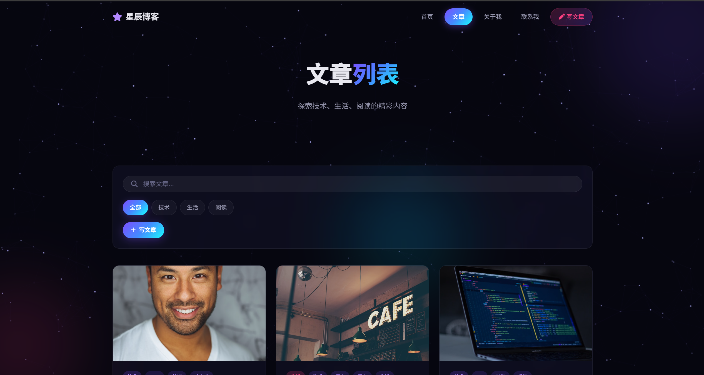
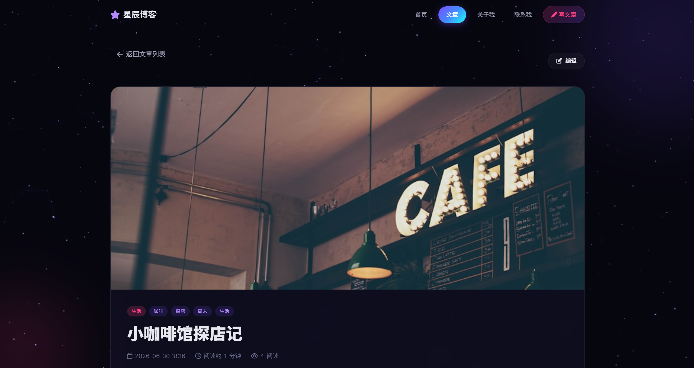
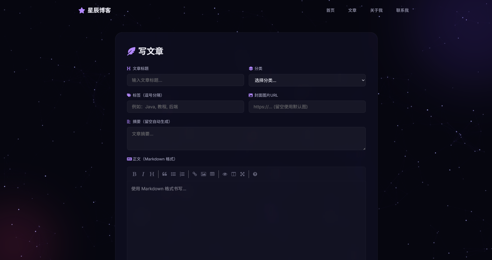
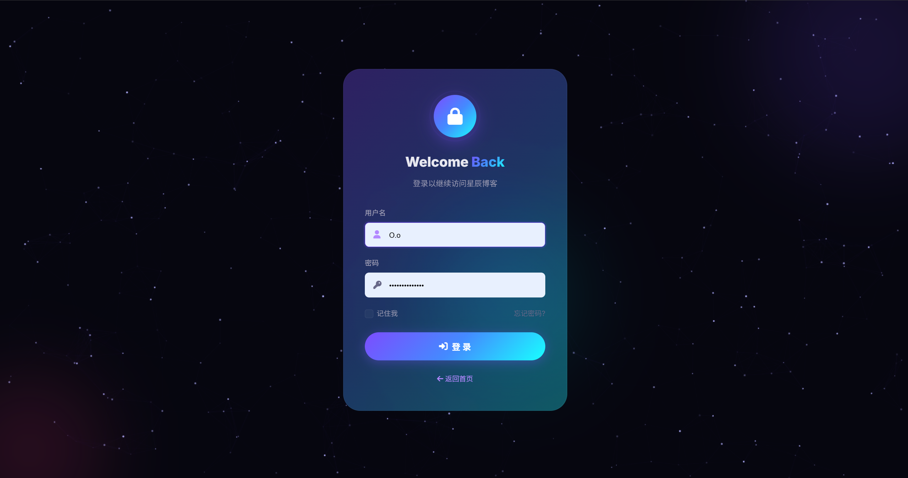
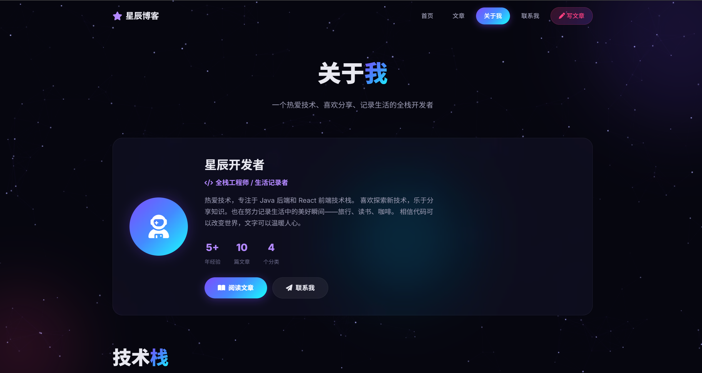

# 星辰博客 (Starry Blog)

基于 Spring Boot 的个人博客系统，支持 Markdown 写作、文章管理、分类筛选和全文搜索。


## 页面预览

| 首页 | 文章列表 |
|------|----------|
|  |  |

| 文章详情 | Markdown 写作 |
|----------|---------------|
|  |  |

| 登录页 | 关于我 |
|--------|--------|
|  |  |

## 技术栈

| 技术 | 说明 |
|------|------|
| Spring Boot 4.1.0 | 后端框架 |
| Spring Data JPA | ORM 数据访问 |
| Spring Security | 身份认证，保护写/改/删操作 |
| Thymeleaf | 模板引擎 |
| H2 Database | 文件型嵌入式数据库，零配置 |
| flexmark | Markdown 渲染（支持表格、任务列表、Emoji 等扩展） |
| SimpleMDE | 在线 Markdown 编辑器 |

## 功能

- **首页** — 精选文章展示，分类浏览入口
- **文章列表** — 按分类筛选、关键词搜索
- **文章详情** — Markdown 渲染、阅读计数
- **写文章** — SimpleMDE 编辑器，Markdown 格式写作
- **编辑/删除** — 文章修改和删除（需登录）
- **关于我** — 个人介绍、技术栈、成长历程
- **联系我** — 联系表单、社交媒体入口
- **登录保护** — 写/改/删操作需要账号密码认证，支持"记住我"（30 天有效）

## 快速启动

### 环境要求

- JDK 17+
- Maven 3.6+

### 开发模式运行

```bash
./mvnw spring-boot:run
```

Windows 下使用 `mvnw.cmd`：

```cmd
mvnw.cmd spring-boot:run
```

启动后访问 **http://localhost:8088**

## 打包部署

### 打包为 JAR

```bash
./mvnw clean package -DskipTests
```

构建完成后，JAR 包位于 `target/blo-0.0.1-SNAPSHOT.jar`。

### 运行 JAR

```bash
java -jar target/blo-0.0.1-SNAPSHOT.jar
```

### 分发给别人使用

打包好的 JAR 是**开箱即用**的，对方只要有 JDK 17+ 即可运行。只需把 JAR 文件发给对方，然后：

```bash
java -jar blo-0.0.1-SNAPSHOT.jar
```

首次启动会自动创建 H2 数据库文件（`data/blogdb.mv.db`）并生成 10 篇示例文章。对方无需安装数据库、无需任何配置。

> **注意**：H2 数据库文件默认生成在 JAR 同级目录下的 `data/` 文件夹中。如需重置数据，删除 `data/` 文件夹后重启即可重新生成示例数据。

## 登录账号

访问 `/write` 页面会跳转到登录页。

| 账号 | 密码 |
|------|------|
| `admin` | `123456` |

登录页支持"记住我"功能，勾选后 30 天内免登录。

## H2 控制台

数据库管理界面：**http://localhost:8088/h2-console**

| 参数 | 值 |
|------|-----|
| JDBC URL | `jdbc:h2:file:./data/blogdb` |
| 用户名 | `sa` |
| 密码 | 留空 |

## 项目结构

```
src/main/java/com/atguigu/blo/
├── BloApplication.java          # 启动入口
├── config/
│   └── SecurityConfig.java      # Spring Security 配置
├── controller/
│   └── BlogController.java      # 所有路由控制器
├── entity/
│   └── Article.java             # 文章实体（JPA）
├── repository/
│   └── ArticleRepository.java   # 数据访问层
└── service/
    └── ArticleService.java      # 业务逻辑 + 种子数据

src/main/resources/
├── templates/
│   ├── index.html               # 首页
│   ├── blog.html                # 文章列表
│   ├── post.html                # 文章详情
│   ├── write.html               # 写作/编辑页面
│   ├── about.html               # 关于我
│   ├── contact.html             # 联系我
│   └── login.html               # 登录页
├── static/css/style.css         # 全局样式
├── static/js/main.js            # 交互脚本（星空背景、导航等）
└── application.properties       # 应用配置
```

## 自定义

### 修改个人信息

编辑 `src/main/resources/templates/about.html` 中的内容（姓名、简介、技术栈、成长历程等）。

### 修改联系方式

编辑 `src/main/resources/templates/contact.html` 中的邮箱、地址、社交链接。

### 修改账号密码

编辑 `src/main/java/com/atguigu/blo/config/SecurityConfig.java` 中的 `userDetailsService()` 方法。

### 修改端口

编辑 `src/main/resources/application.properties` 中的 `server.port`。

## 添加截图

在项目根目录创建 `screenshots/` 文件夹，放入以下截图即可让 README 展示页面预览：

```
screenshots/
├── home.png      # 首页
├── blog.png      # 文章列表页
├── post.png      # 文章详情页
├── write.png     # 写文章页
├── login.png     # 登录页
└── about.png     # 关于我页面
```

## License

MIT
